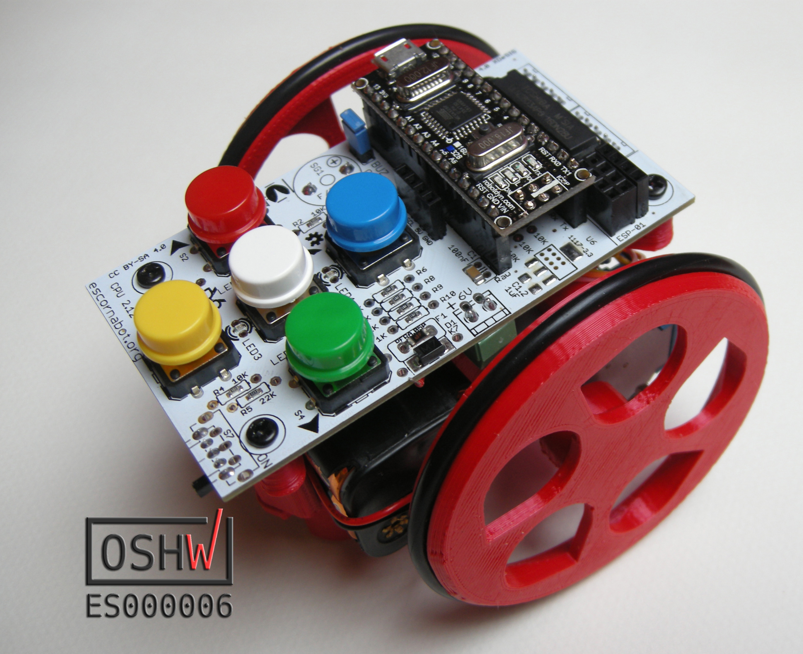
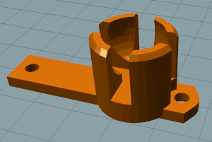
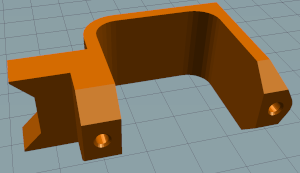
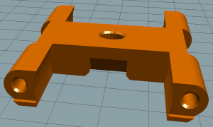
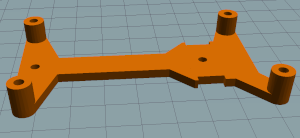
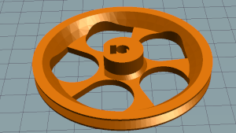
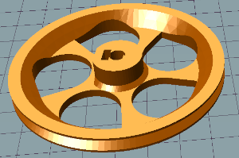

# Escornabot Singularis Tiflo

- Collection of printable parts needed to assemble the Escornabot Singularis or Pseudo Singularis
with two modifications to help the assembly by blind people (tested in three ONCE workshops)

## 3D parts (STL)

###  Singularis and Pseudo Singularis

image         | file
------------- | -------------
 | [soporte-bola.stl](STL/soporte-bola.stl)
 | [soporte-pilas.stl](STL/soporte-pilas.stl)
 | [soporte-motor_N.stl](STL/soporte-motor_N.stl)
 | [SoporteCPU_N.stl](STL/SoporteCPU_N.stl)
 | [wheel-r.stl](STL/wheel-r.stl)
 | [wheel-l.stl](STL/wheel-l.stl)

## License attribution

  - Só as pezas soporte-motor_N e SoporteCPU_N foron modificadas por XDeSIG, para mellorar a montaxe por persoas cegas "Tiflo".  As pezas son orixinais de  Xoan Sampaiño e Rafa Couto
  - Only the engine-bracket_N and CPU_N support parts have been modified by XDeSIG, to improve the assembly for blind people "Tiflo". The pieces are original by Xoan Sampaiño and Rafa Couto

